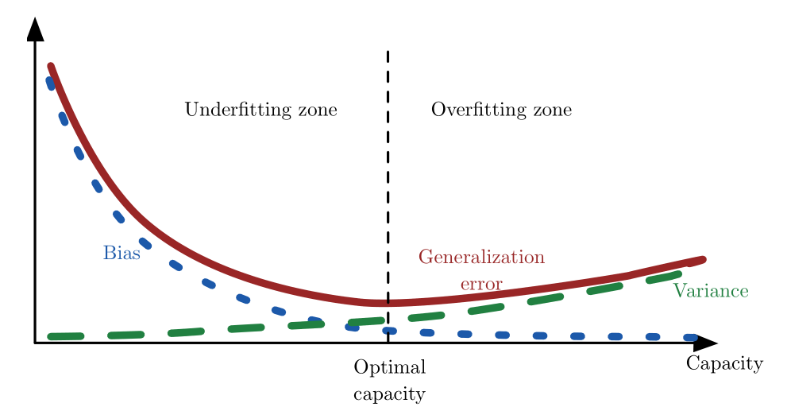

# 第一部分 应用数学与机器学习基础

## 第二章

- Moore-Penrose 伪逆？？

## 第三章

- Multinoulli分布？？
- KL散度，交叉熵？？

## 第四章

- 梯度下降法，一阶优化算法
- 线搜索
- 雅克比矩阵，Hessian矩阵
- 牛顿法，二阶优化算法
- Lipschitz 连续

## 第五章

- 测试集效果一定比训练集好？？
- VC维
- 非参数模型：
  - 最近邻
- 贝叶斯误差：从预先知道的真实分布 p(x,y) 预测而出现的误差
- 点估计、函数估计
- **5.4 估计、偏差和方差**
- 
- 一致性
- **5.5 最大似然估计**
- **5.6 贝叶斯统计**
- 平滑先验/局部不变性先验？？
- 流形学习？？