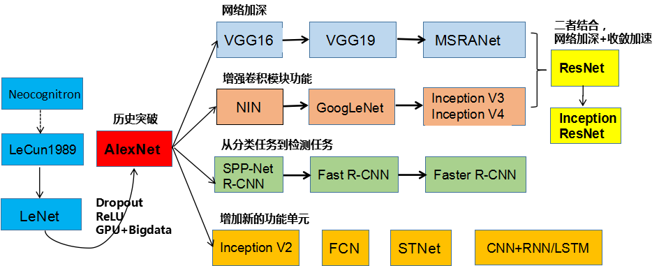

## 1

- MCP神经元模型由Warren McCulloc和Walter Pitts提出于1943年，可以看作是人工神经网络研究的起点。A logical calculus of the ideas immanent in nervous activity
- Dropout由Hinton组提出于2012年
- Batch Normalization提出于2015年
- 1958年，Frank Rosenblatt提出了感知机模型
- 1969年，Marvin Minsky和Seymour Papert在一本名为感知机的专著Perceptrons: An Introduction to Computational Geometry中指出，感知机不能解决XOR问题，从而宣告了感知机甚至人工神经网络研究的死刑，造成了NN长达十几年的寒冬，这也是NN研究的第一次寒冬
- 1962年，Hubel和Wiesel提出了视觉皮层的功能模型，从简单细胞到复杂细胞再到超复杂细胞
- 1974年，Webos在其博士论文中就提出来BP的思想
- 1980年，神经认知及提出，简单细胞被实现为卷积，复杂细胞被实现为pooling
- 今天我们广为使用的BP算法则由Hinton等人“重新”发明于1986年。
- 1986年，David Everett Rumelhart、Geoffrey Everest Hinton和Ronald J. Williams在Nature上发表Learning Representations by Back-propagating errors，反向传播算法
- 1991年，Sepp Hochreiter和Juergen Schmidhuber提出LSTM(long short-term memory)模型
- 然而由于多层网络训练困难：梯度消失问题，训练数据和计算资源不足，NN研究在20世纪末再次进入寒冬，这段时间更为流行的方法包括决策树，SVM等，八卦一下，NN研究曾长期是一门“显学”，SVM引用次数最多的那篇文章的题目叫Support Vector Network
- 1998年，SVM算法可以将手写体识别的错误率降低到0.8%
- 2006年，NN的研究迎来转机，Hinton、Bengio等人经过跨世纪的努力，提出了通过分层无监督预训练的策略来解决多层网络收敛困难的问题，深度学习也因此得名。新的网络结构：DBM,DBN,DAE
- 2016年，谷歌关于tensorflow的论文TensorFlow: Large-Scale Machine Learning on Heterogeneous Distributed Systems

## 2

- 第一个CNN模型LeNet诞生于1989年，发明人LeCun，Backppropagation Applied to Handwritten Zip Code Recognition

- - LeCun同时研究了四个问题，这也是文章中留下的四枚彩蛋

  - 1. 正切激活函数收敛更快
    2. sigmoid归一+欧式损失
    3. 网络参数初始化
    4. SGD

- 1998年，LeNet-5模型，由Yann LeCun在Gradient-based learning applied to document recognition中提出0

- 2012年，由Alex Krizhevsky实现的AlexNet在当年的ImageNet图像分类竞赛中，top-5错误率比上一年的冠军下降了十个百分点：Relu和Dropout的提出。原因：

- 1. 非线性激活函数：ReLU
  2. 防止过拟合的方法：Dropout，Data augmentation
  3. 大数据训练：百万级ImageNet图像数据
  4. 其他：GPU实现，LRN归一化层的使用

- 2012年之后，大数据训练和GPU并行计算，CNN朝着不同方向演化

- 第一条演化路径：网络变深

- - 2014-VGG Net
  - 2015-MSRA-Net

- 第二条演化路径，增强卷积模块的功能

- - 2013-Network in Network 颜水成老师于2014年取得了ILSVRC物体检测竞赛的冠军
  - 2014-GoogLeNet 在NIN的基础上，Google于2014年提出了GoogLeNet（Inception V1），并随后改进出Inception V3和V4
  - Residual Net可以看作是前两条演化路径的集成。何凯明等人发现，单纯增加深度会导致网络退化
  - 2016年初，何凯明等提出了恒等映射深度残差网络

- 第三条演化路径：从物体识别到物体检测

- - CNN的缺点是速度慢
  - Fast R-CNN是R-CNN和SPP Pooling的融合

- 第四条演化路径：增加新的功能模块