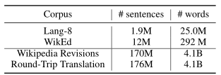
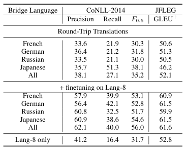

[TOC]

# 文献阅读

## Corpora Generation for Grammatical Error Correction（2017.12）

GEC缺乏丰富的并行数据，本文描述了两种使用公共维基百科数据，为GEC生成大型并行数据集的方法。

### 两种方法

1. 使用来自于**维基百科的历史修改**记录作为增广的语料。
2. 使用来自于**回环翻译**(RTT)的语料。从维基百科中提取目标句子，将其翻译成一种语言再翻译回来，可以得到相对干净的错误。语料库比人工导出的维基百科语料库的噪音小得多。但不同于人类错误，它产生的错误范围较小。

与真实数据相比所得到的数量：

### 迭代解码

语料中的许多句子包含了不止一个的语法错误，因此，单次解码不能保证把所有的语法错误全部纠正过来。本文提出了一个迭代解码的算法，使得模型有多次机会选择高置信度的变换纠错，直到找不到任何可以纠正的地方。

### 结果

使用来自维基百科作为增广语料的结果：

使用来自RTT回环翻译语料的结果：

融合两种数据集的结果：

### 结论

在Lang-8语料库上的微调和集合模型使得本文超越了CoNLL-2014基准和JFLEG任务，语料增广技术对于模型在低资源任务上的效果提升有着非常重要的影响。