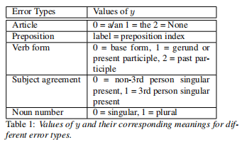
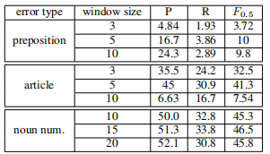
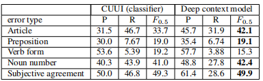
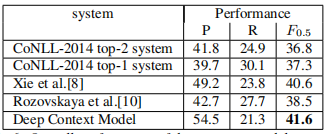

[TOC]

# 文献阅读

> 第4篇文献：《Deep Context Model for Grammatical Error Correction》

## GEC的深度上下文模型

### 摘要

基于RNN，将纠错视为分类问题，无需特征工程，在CoNLL-2014上达到SOTA

### 1. 介绍

GEC常用的任务有：HOO和CoNLL

使用的方法常基于三种：

1. **预定义规则**
2. **分类**（常需要手工设计特征，无需注释数据，容易包含深层的上下文信息）
   1. 浅层特征：POS，parsee information
3. **机器翻译**（SMT，基于短语的和NMT）

本文方法：

1. 使用双向门控循环单元(GRUs)表示上下文，无需特征工程

### 2. 模型

- 基于context2vec
- 
- deep contex vector：例如go，左侧的GRU+右侧的GRU得到上下文向量
  - biGRU(w1:n, i) = lGRU(w1:ii 1) ⊕ rGRU(wi+1:n)
- 将连接起的向量送入MLP来捕获两边的相互依赖性，在第二层使用softmax来预测目标单词或其状态
  - MLP(x) = sof tmax(ReLU(L(x)))
- 若预测不一致，则检测到语法错误，使用预测来纠正
- 模型的输出为：
  - y = MLP(biGRU(w1:n, i))
- y值含义：
  - 
- 其它方法将错误统一处理，本文方法为每个特定的语法错误建立了模型

### 3. 实验

- **实验数据**：<https://dumps.wikimedia.org/enwiki/>，CoNLL-2014的测试集：1312条句子
- **评价指标**：F0.5（联合了精度P与召回率R，精度有二倍权重）
  - 
    - g为特定错误类型的人工的黄金标准，e为相关的系统编辑
- 使用**Glove word embedding**来初始化词嵌入，大小为300，输入文本小写，不在词汇表中则标记为unk，词汇表由wiki dump中常用的40000个单词组成。
- **错误类型**
  - 冠词；介词；动词形式；名词number；主谓一致。
  - 使用 Stanford corenlp tools来定位需要被检查的目标单词，检测到则进行纠正
  - 冠词问题分三类；介词特定11个；动词形式问题分三类；名词分两类；主谓一致问题分两类；
- **窗口大小**
  - 主谓一致，动词形式：整个句子
  - 冠词，介词，名词数量分别为：5，3，15
    - 
  - 在名词模型中加入Lemma，效果更好
    - 
- **结果**
  - 
    - 在F0.5下，本文模型有四个任务更好
    - 在精度下，本文模型全部任务最佳，因为在本模型中，精度更重要
  - 
    - 修复了机械错误后，与其它在CoNLL-2014测试集上的SOTA模型进行了比较。
      - top-1是结合了规则和机器翻译方法的混合模型
      - top-2是基于系统的分类器（Table 3的CUUI）

### 4. 总结与将来工作

- 提出了一种新的神经网络架构来学习上下文表示，并用于GEC，其性能超过其它SOTA。该模型不需要复杂的特征工程，因为上下文特征表示可以由分类器以端到端的形式进行学习。
- 计划**注意力机制**引入该模型，从而使得模型能够仅仅关注到影响语法的上下文单词。

