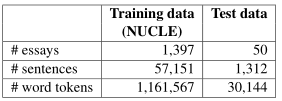
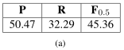
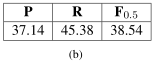

[TOC]

# 文献阅读

> 第5篇文献：[《The CoNLL-2014 Shared Task on Grammatical Error Correction》](https://www.comp.nus.edu.sg/~nlp/conll14st/CoNLLST01.pdf)

## 关于GEC的CoNLL-2014共享任务

### 任务定义	

- 本次任务的目标是评估自动检测和纠正的算法和系统，其应用在由英语第二语言学习者撰写的英文文章中存在的语法错误
- 本次任务有**28种**错误类型，而HOO 2012中有2种错误，CoNLL-2013中有5种错误
- 需要能够纠正多个错误

### 数据

- 训练数据
  - 由NUS的非英语母语学生撰写的**1397**篇文章，其中语法错误由专业英语教师进行了手工矫正
  - 对NUCLE语料进行了**预处理**，使用NLTK进行句子分割，单词标记化，使用Stanford Parser进行的成分与依赖树分析，和词性标记
  - 最初在**字符级别**，然后映射到**单词级别**
  - 加强了冠词、限定词和介词的错误检测，
  - 
- 测试数据
  - 同样的25名学生撰写的新论文作为盲测数据，每个学生根据两个提示写2篇文章，第一个提示也用于训练数据，第二个提示全新，得到**50篇**文章
  - 同样进行人工矫正和预处理

### 评估指标和打分器

- 一个语法错误纠正系统是由它的纠正与黄金标准的**匹配程度**来评估的
- 有三个指标，**精确度P**，**召回率R**，**F0.5**（CoNLL-2013使用的是F1，F0.5中P的权重是R的两倍，而F1中二者相同）
- 官方打分器：
  - **MaxMatch (M2)** scorer (Dahlmeier and Ng, 2012b)

### 队伍方法

- 有13个队伍提交了系统，针对非特定错误矫正，基于**语言模型(LM)**的方法最为流行，但全部是混合模型，没有单独使用
- 纠正所有错误的方案是使用基于短语的统计**机器翻译(MT)**系统，各队伍在微调方面不同
- 没有队伍使用基于语法的翻译模型，除了UMC在分解翻译模型中使用了词性标签
- 对于纠正单一错误类型，基于规则(RB)的方法很常见

### 结果

- 
- 错误类型的召回率容易计算，错误类型的精度计算较为困难，因此基于召回率来计算每种错误类型的性能
  - 为了测量两个注释之间的一致性，计算了Kappa系数(Cohen, 1960)，结果为0.43，表明中等一致性
  - 系统对两个注释的效果差异较大，精度变化不超过10%，说明应根据多个标准注释来进行评价
  - 将两个标准注释分别作为黄金标准来计算另一个的评价指标，得到结果为：
    - 
    - 
    - 该结果是本数据集的**性能上限**，较低的值表明有可以有很多方法纠正一个句子