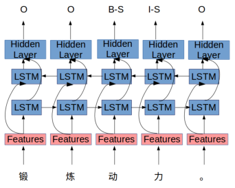
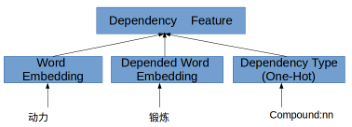

[TOC]

# 文献阅读

> 第7篇文献：[《Alibaba at IJCNLP-2017 Task 1:Embedding Grammatical Features into LSTMs for Chinese Grammatical Error Diagnosis Task》](https://www.aclweb.org/anthology/I17-4006)

## 将语法特征嵌入到LSTM中用于中文语法错误诊断任务

### 1 介绍

- 中文没有单复数变化，动词的时态变化，结构松散，短句较多，从句较少

### 2 中文语法错误诊断

- 有4种错误：R（冗余错误），S（选择错误），M（缺失错误），W（顺序错误）
- 完成以下任务：
  - 判断句子是否正确
  - 句子包含哪些错误
  - 确切的错误位置

### 3 相关工作

- LSTM已被证明其在NLP一般序列相关建模(Hochreiter和Schmidhuber, 1997)和语法错误诊断(Zheng et al., 2016)中的效率。
- 2012年，(Yu and Chen, 2012)提出了一种基于CRF的分类器来检测单词排序错误
- 2014年，(Chang et al., 2014)提出了基于规则的诊断系统
- 2014/2015/2016年，(Yu et al., 2014; Lee et al., 2015, 2016)发表于NLPTea
- 2014年，(Ferraro et al., 2014)提出了一种基于CRF的搭配，词性语言特征模型
- 2016年，(Zheng et al., 2016)提出了一种基于二元嵌入的字符嵌入的CRF BiLSTM模型

### 4 方法

#### 4.1 模型描述

- 将CGED问题视为序列标记问题，使用双向LSTM单元作为RNN单元对输入序列进行建模
- 

#### 4.2 特征工程

- 因缺少训练数据，所以特征工程非常重要
- 
  - **Char**：使用字符嵌入，随机初始化字符嵌入
  - **Char Bigram**：Bigram是一个信息性和区别性的特征，是模型容易学习邻近字符的搭配程度
  - **POS**：包含动词，副词，形容词和名词
  - **POS Score**：使用由`Gigawords dataset`计算的单词标签的离散概率作为一个特征
  - **Adjacent Word Collocation**：邻近词的搭配由PMI分数评价
  - **Dependent Word Collocation**：搭配关系不局限在邻近词，通过依赖性分析来得到每个词的依赖词，使用了子网络，输入为词嵌入的连接，依赖词的词嵌入和依赖关系
    - 

#### 4.3 模型集合

- 由于随机初始化，随机dropout和随机训练顺序，每次训练结果都不同，由此设计了3种集合方法
  1. 简单合并结果，召回率增加，但精度大幅下降
  2. 使用LSTM-CRF生成的分数来对每个模型生成的错误进行排名，每个模型删除了20%的错误，然后合并。在一定程度提高了精度，但难以超过单一模型
  3. 使用了投票，在保持召回率的同时大大提高了精度
- 使用了4组参数，每组训练了2个模型，因此得到8个模型
- 3种不同集合方法都获得了最佳F1分数

### 5 实验

#### 5.1 数据分割和实验设置

- 使用了2015，2016和2017年的数据，其中2017年的20%用作验证集，其余用作训练
- 正确句子能改善结果，所以所有的正确句子在训练集中
- 使用`Gigawords dataset`预训练bigram-char嵌入和词嵌入，在训练时固定
- 性能指标在三个级别上：检测，识别，位置
- 评价指标：误报率，准确率，精度，召回率和F1分数

#### 5.2 实验结果

##### 5.2.1 验证集上的结果

- 使用验证集选择单LSTM-CRF模型的最佳超参数，选择了4组参数，每组训练2个模型
- 虽然组之间存在一定程度的差异，但每个单一参数组的模型性能也较好
- 

##### 5.2.2 评估集上的结果

- 将验证集与训练集合并重新训练
- 

### 6 结论与未来的工作

- 本文结合了一些手工特征，如POS，依赖性特征，PMI分数等来训练LSTM-CRF模型，在精度，召回率和F1分数上达到最佳
- 未来希望基于seq2seq等模型直接纠正错误，通过结合预训练语言模型和其他相关的多任务模型来获得端到端语法错误识别系统

