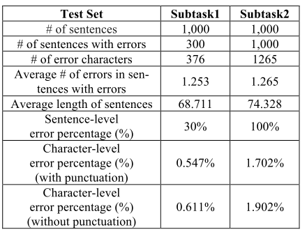

[TOC]

# 文献阅读

> 第8篇文献：[《Chinese Spelling Check Evaluation at SIGHAN Bake-off 2013》](<https://www.aclweb.org/anthology/W13-4406>)
>
> SIGHAN Bake-off 2013的任务综述，官网：<http://ir.itc.ntnu.edu.tw/lre/sighan7csc.html>

# SIGHAN Bake-off 2013的中文拼写检查评估

## 1 介绍

- 中文拼写检查与其它字母语言有很大不同，单词之间没有分隔符，单词长度很短
- 两个任务：错误检测和错误纠正

## 2 任务描述

### 2.1 子任务1：错误检测

- 每个字符或标点用1个点来计算位置，若输入没有错误，系统返回：`NID, 0`；若包含错误，则返回：`NID, location [, location]*`（*表示0个或多个预测元素“[, location]”）
- 例如：
  - Input: (NID=99999) 在我的人生中沒有風 災大浪，但我看過許多勇敢的人，不怕 措折的奮鬥，這種精神值得我們學習。
  - Output: 99999, 27

### 2.2 子任务2：错误纠正

- 输入是具有拼写错误的完整中文句子，系统应返回错误位置，且指出正确字符
- 输出格式：`NID [, location, correction]+`，+表示1个或多个预测元素[, location, correction]
- 例如：
  - Input: (NID=88888) 擁有六百一十年歷史 的崇禮門，象微著南韓人的精神，在一 夕之門，被火燒得精光。
  - Output: 88888, 16, 徵 29, 間

## 3 数据准备

### 3.1 样本集和相似字符集

- 样本集：700个样本，一半有错误，一半正确
- 相似字符集：具有相似发音和形状

### 3.2 测试集

- 
- 句子的平均长度约为70个字符，为了减小测试集大小，删除了大多数没有错误的句子
- 子任务1和子任务2的字符级错误百分比分别约为0.5％和2％
- 难点1：一些老师认为不是错误的，手动删除
- 难点2：保留原始语境，修改了语法错误的句子

## 4 性能指标

### 4.1 错误检测指标

- 采用句子级别来度量，因为字符级别错误非常少，计算公式如下：
  - 误报率(FAR)= 误报错误数 / 没有错误的测试句子
  - 检测准确度(DA)= 正确检测的结果数 / 所有测试句子
  - 检测精度(DP)= 正确检测的错误数 / 系统评估错误的句子数
  - 检测召回率(DR)= 正确检测的错误数 / 具有错误的测试句子数
  - 检测F1(DF1) = 2\*DP*DR / (DP+DR)
  - 错误位置准确的(ELA) = 正确的位置检测 / 所有测试句子
  - 错误位置精度(ELP) = 正确的错误位置 / 系统评估的错误句子数
  - 错误位置召回率(ELR) = 正确的错误位置 / 具有错误的测试句子数
  - 错误位置F1(ELF1) = 2\*ELP*ELR / (ELP+ELR)

### 4.2 错误纠正指标

- 位置准确度(LA) = 正确检测的错误位置数 / 所有测试句子
- 纠正准确度(CA) = 正确纠错数 / 所有测试句子
- 纠正精度(CP) = 正确纠错数 / 系统返回的纠错数

## 5 评估结果

- 大多数队伍采用了统计方法，如：n-gram模型，语言模型，机器翻译模型和主题模型
- `Chinese Gigaword`和`Sinica Corpus`语料库被广泛应用

### 5.1 错误检测结果

- 低误报率也很重要，NTHU和SJTU在召回率大于0.5的同时，保持了误报率小与0.05
- 若考虑F1分数，SinicaCKIP达到最佳错误检测结果；NTHU实现了指明错误位置的最佳检测效果，获得了最佳错误位置F1分数
- 整体上，NTHU，SJTU和SinicaCKIP较好

### 5.2 错误纠正结果

- NCYU和SJTU整体上较好

## 6 讨论

- 错误一般分三种：错误单词在声音、形状或含义上与正确的相似。声音与形状相似较多，最难的是语义造成的错误

## 7 结论和未来的工作

- 本次评测促使建立更多的中文资源，以便改进中文拼写检查的最先进技术
- 希望准备的数据集可以成为一个基准