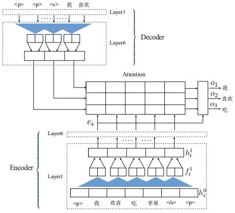
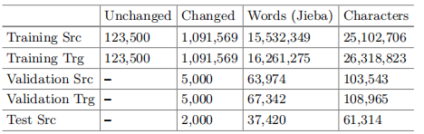
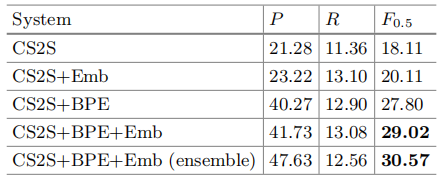

[TOC]

# 文献阅读

> 第9篇文献：[A Sequence to Sequence Learning for Chinese Grammatical Error Correction](<https://link.springer.com/chapter/10.1007/978-3-319-99501-4_36>)
>
> 北京语言大学团队的论文：2018 NLPCC Chinese Grammatical Error Correction比赛第三名
>
> 源码地址：<https://github.com/blcu-nlp/NLPCC_2018_TASK2_GEC>

# 一种用于中文语法错误纠正的seq2seq学习

## 1 介绍

- 中文缺少动词变形和复数后缀
- 英语语法纠正已经研究多年，取得了很大进展。中文相关的任务有语法错误诊断的共享任务(GED)和在CGED上组织的IJCNLP 2017共享任务，但其任务集中在检测语法错误而不是自动生成纠正

## 2 语法错误纠正

- NLPCC 2018共享任务2的目标：评估用于自动检测和纠正来自中文第二语言学习者的语法错误的算法和系统
- 四种类型错误：冗余词(R)，遗漏词(M)，坏词选择(S)，无序词(W)
- 衡量指标：精度，召回率和F0.5

## 3 方法

- 收到Gehring等人的启发，基于完全卷积encoder-decoder架构，具有多层卷积和attention机制
- 大多数 语法错误通常是本地化的，并且更多地依赖于附近的单词，因此CNN可以通过较小的窗口来捕获局部上下文，比RNN更有效
- 远距离单词之间更广泛的上下文和交互也可以通过多层次卷积结构来捕获
- 在预测目标词时使用**attention**机制，它在源词上基于相关性分配权重
- 使用RNN时，非线性运算的数量与输入的长度成比例，从而减少了远端单词的影响。而我们的模型在输入上只实现固定数量的非线性运算而忽略其长度

### 3.1 卷积seq2seq模型

- 将输入源句子S嵌入为m个源词的序列（s1, ... , sm, si∈wsi），从每个字的嵌入矩阵中查找嵌入向量，同时通过嵌入输入元素（p=(p1, ... , pm)）的绝对位置添加了顺序感知。
- 联合起来得到输入句子的表示：s = (w1 + p1, ... , wm + pm)
  - 类似的方式应用到解码器网络产生的输出元素上
- 
- 编码器和解码器各自由L层组成，共享一个块结构，它基于输入元素的固定数量来集计算中间状态
- 该框架目标是估计条件概率P(yi+1|y1, ... , yi, S)

#### 3.1.1 编码器

- 将源嵌入（s1, ... , sm）传入第一个编码层，得到输入向量（h1, ... , hm），h是所有层的输入输出维度
- 第一个编码层中，卷积核参数化为W和bw，并作为输入X，然后将它映射到单个输出元素Y
- 接下来使用门控线性单元GLU
- 为了使用卷积网络，将每个编码层输入向量的残余连接添加到层的输出
- 最后的编码层的每个输出向量是由线性映射得来的

#### 3.1.2 解码器

- 每个解码层都有自己的多步注意力，为了计算注意力，将当前解码器状态与前一个目标元素的嵌入相联合得到z
- 注意力权重α由编码器输出向量e与z点乘得到，并使用softmax进行标准化
- 添加源嵌入有助于更好的保留上下文信息，条件源上下文向量x是编码器输出和源嵌入的权重之和
- 上下文向量x然后被线性映射为c，解码层l的输出向量g是c，y和前一层输出向量g的和
- 最后的解码层输出向量g被线性映射为d，再经过一个线性映射和softmax得到输出
- 在解码层输出，嵌入和每个编码器和解码器前使用dropout

## 4 实验设置

### 4.1 数据

- 来自于Lang-8，共1220069个句子对，将数据集分成两部分，验证集5000对，其余为训练集
- 将所有没有语法错误的句子添加到训练集中，测试数据包含2000个句子对
- 

### 4.2 数据准备

- 使用**jieba**进行分词
- **子词（subword）**：最初由字节对编码（BPE）提出，有助于结局罕见和未知单词的问题。因此将BPE算法应用于我们的任务，该任务将罕见词分成多个频繁子词。该方法可大大提高模型性能，两种分割方法的结果如下：
  - 
- **词嵌入**：使用从未标记的大型语料中学到的预训练的单词嵌入，来初始化源和目标单词的嵌入，该方法可大大提高模型性能，而不是随机初始化网络

### 4.3 实验结果

- 

## 5 相关工作

- 与NMT相比，SMT具有有限的泛化能力，无法有效地访问更长的文本，为此提出了几种依赖RNN的seq2seq方法
- *Yuan, Z., Briscoe, T.: Grammatical error correction using neural machine translation. In: NAACL (2016)*应用了一种流行的神经机器翻译模型RNNSearch
- *Ji, J., Wang, Q., Toutanova, K., Gong, Y., Truong, S., Gao, J.: A nested attention neural hybrid model for grammatical error correction. In: ACL (2017)*提出了一个基于混合机器翻译模型的词-字模型
- *Schmaltz, A., Kim, Y., Rush, A.M., Shieber, S.M.: Adapting sequence models for sentence correction. In: EMNLP (2017)*在带有编辑操作的Lang-8和NUCLE上训练，使用了一个单词级别的双向LSTM网络
- *Gehring, J., Auli, M., Grangier, D., Yarats, D., Dauphin, Y.: Convolutional sequence to sequence learning. In: ICML (2017)*提出了一种完全卷积的seq2seq建模的体系结构

## 6 结论和将来的工作

- 本文描述了我们在GEC的NLPCC 2018共享任务2中的系统，探索了一个完全基于卷积神经网络的seq2seq模型。
- 应用基于BPE的算法将罕见词分成多个频繁子词使得GEC模型更能够处理OOV问题，我们获得了最高的精确度分数，F0.5得分为30.57
- 未来方向包括将语法错误纠正与其他相关的多任务模型相结合，向模型添加更多特征以及调整预训练语言模型
- 在未来的工作中，将研究更好的测量和评估标准