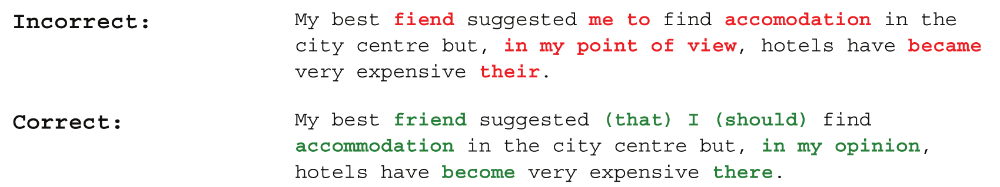

[TOC]

# 暑期项目总结

## 1 语法纠错总结

### 1.1 简介

语法错误纠正（Grammatical Error Correction，GEC），就是自动地纠正文本中存在的语法错误，下图给出了一个直观的例子。具体的，一个GEC系统，通过分析输入句子的上下文，识别并纠正其中存在的任何语法错误，最终输出一个无语法错误的句子，且保留原句的语义不变。如果输入句子中不存在语法错误，GEC系统应直接返回原句。



### 1.2 方法概述

GEC这一任务在方法上经历了由规则到统计的演变，大体可分为3个阶段：

#### 1.2.1 基于规则的方法

这一类方法通过硬编码规则来进行纠错。世界上第一个GEC系统，Writer's Workbench（1982年），就完全基于字符串的匹配和替换。对于某些特定类别的错误，基于规则的方法易于实现且十分有效，因此，直到今天，该方法仍被广泛使用。然而，考虑到语言的复杂性，基于规则的方法并不适合作为GEC的通用方法。

#### 1.2.2 数据驱动的传统机器学习方法

随着语料资源的不断累积，从20世纪90年代开始，数据驱动的方法成为GEC的主流，人们利用机器学习技术（SVM、朴素贝叶斯），为不同错误类别设计单独的分类器。这类方法对冠词、介词等错误的纠正效果十分明显，但也存在一些问题。其仅利用了句子中局部的上下文信息，且只能独立地考虑不同的错误类别，对于一些交互式错误则无能为力。下面给出一个例子。

假设原句为：

`Social network plays a role in providing and also filtering information.`

显然，句子中network需改为networks，plays需改为play。而采用对多个分类器做pipeline组合的纠错方法，假设主谓不一致先于名词单复数纠正，则纠正后的句子为：

`Social networks plays a role in providing and also filtering information.`

仍然存在主谓不一致错误。

#### 1.2.3 基于神经机器翻译(Neural machine translation，NMT)的方法

将语法错误纠正看成是把“坏”句子翻译成“好”句子的思想最早来源于Brockett等人（2006年）,但直到2014年，该方法才逐渐成为GEC的主流，并迅速发展、迭代。在CoNLL2014年（CoNLL是NLP领域的一个年度评测会议）的GEC评测中，剑桥大学提交的基于统计机器翻译（Statistical Machine Translation，SMT）的GEC系统一举夺冠。之后，许多改进的方法被陆续提出，其中一个方法，rerank，即提取语言学特征对SMT解码得到的若干候选句子进行重排序，对纠错性能提升十分明显，基本成为GEC的一个必备环节。而随着神经机器翻译（Neural machine translation，NMT）逐渐取代SMT，NMT被很自然地引入到GEC，成为state-of-the-art GEC系统的核心组件。

##### 1.2.3.1 encoder-decoder模型

encoder-decoder模型的思想很简单，用一个神经网络（encoder）将输入句子编码成一个固定长度的向量，接着用另一个神经网络（decoder）基于该向量进行解码，输出纠正后的句子。

encoder-decoder模型看似简单，实则非常强大，够直接、有效地进行建模。

##### 1.2.3.2 注意力机制(attention mechanism)

理论上，一个充分复杂的encoder-decoder模型，可以完美地解决像翻译、纠错这样的问题。但是，在实际应用时，受训练数据规模的限制，模型不能无限大，这使得encoder-decoder模型面临两个突出的问题：长距离依赖和输入的表示。

注意力机制的提出就是为了解决这一问题。在encoder对输入句子编码时，保留每一个词对应的隐状态向量，而在decoder解码时，充分利用这些信息（隐状态向量），而不是仅仅依赖encoder输出的最后一个隐状态向量。

##### 1.2.3.3 重排序(rerank)

encoder-decoder模型加attention，这基本就是当前state-of-the-art GEC系统的核心，但为了进一步提高纠错性能，还有一个重要的实用步骤—重排序。

典型的端到端Seq2Seq，直接将解码（如beam search）搜索得分最高的结果作为输出。但很多时候，由于encoder-decoder模型存在误差，解码时得分最高的结果并不一定是最好的，重排序对这一问题做了优化。

具体做法很简单，比如说，使用beam search解码，保留得分最高的前k个候选句子，然后，在解码得分的基础上，引入若干特征（如输出句子在外部语言模型上的概率得分、与输入句子的编辑距离），对这k个候选句子重新排序，然后选择新的得分最高的句子作为最终输出。

### 1.3 具体实现方法

#### 1.3.1 SMT与NMT混合模型（[Near Human-Level Performance in Grammatical Error Correction with Hybrid Machine Translation](https://arxiv.org/pdf/1804.05945.pdf)）

该文章混合了SMT和NMT两种方法来进行GEC处理，得到的混合系统在**CoNLL-2014**的M2指标和**JFLEG**的GLEU指标下分别取得了**50.19**和**56.74**的结果，优于前人结果。

#### 1.3.2 基于流畅度增强学习和推断机制（[Reaching Human-level Performance in Automatic Grammatical Error Correction: An Empirical Study](https://arxiv.org/abs/1807.01270)）

该文章使用全新的基于流畅度增强学习和推断机制(fluency boost learning and inference mechanism)的seq2seq模型来进行GEC处理，在**CoNLL-2014**的M2F0.5指标和**JFLEG**的GLEU指标下分别取得了**75.72**和**62.42**的结果，在这两个基础上首次超越人类。

#### 1.3.3 数据增强（[Corpora Generation for Grammatical Error Correction](https://arxiv.org/abs/1904.05780)）

GEC缺乏丰富的并行数据，本文描述了两种使用公共维基百科数据，为GEC生成大型并行数据集的方法。

1. 使用来自于**维基百科的历史修改**记录作为增广的语料。
2. 使用来自于**回环翻译**(RTT)的语料。从维基百科中提取目标句子，将其翻译成一种语言再翻译回来，可以得到相对干净的错误。语料库比人工导出的维基百科语料库的噪音小得多。但不同于人类错误，它产生的错误范围较小。

#### 1.3.4 双向门控循环单元GRUs（[Deep Context Model for Grammatical Error Correction](https://www.isca-speech.org/archive/SLaTE_2017/pdfs/SLaTE_2017_paper_5.pdf)）

提出了一种新的神经网络架构来学习上下文表示，并用于GEC，其性能超过其它SOTA。该模型不需要复杂的特征工程，因为上下文特征表示可以由分类器以端到端的形式进行学习。

#### 1.3.5 语言模型（[Language Model Based Grammatical Error Correction without Annotated Training Data](https://aclweb.org/anthology/W18-0529)）

GEC中语言建模背后的核心思想是，低概率序列比高概率序列更可能包含语法错误。基于LM概率的GEC的目标是，确定如何将低概率序列转换为高概率序列。

本文方法基于：[Dahlmeier and Ng (2012a)](https://www.aclweb.org/anthology/W12-2025)，包含五步：

1. 计算输入句子的归一化对数概率
2. 为每个句子构建一个混淆集合
3. 在混淆集合中为替代候选的句子重新打分
4. 应用单个最佳校正，将概率提高到阈值以上
5. 重复步骤1-4

#### 1.3.6 基于LSTM（[Alibaba at IJCNLP-2017 Task 1:Embedding Grammatical Features into LSTMs for Chinese Grammatical Error Diagnosis Task](https://www.aclweb.org/anthology/I17-4006)）

将CGED问题视为序列标记问题，使用双向LSTM单元作为RNN单元对输入序列进行建模，因缺少训练数据，所以特征工程非常重要。

进行了模型集合，设计了3种集合方法：

1. 简单合并结果，召回率增加，但精度大幅下降
2. 使用LSTM-CRF生成的分数来对每个模型生成的错误进行排名，每个模型删除了20%的错误，然后合并。在一定程度提高了精度，但难以超过单一模型
3. 使用了投票，在保持召回率的同时大大提高了精度

#### 1.3.7 基于seq2seq模型（[A Sequence to Sequence Learning for Chinese Grammatical Error Correction](https://link.springer.com/chapter/10.1007/978-3-319-99501-4_36)）

设计了基于完全卷积encoder-decoder架构，具有多层卷积和attention机制。大多数 语法错误通常是本地化的，并且更多地依赖于附近的单词，因此CNN可以通过较小的窗口来捕获局部上下文，比RNN更有效。

远距离单词之间更广泛的上下文和交互也可以通过多层次卷积结构来捕获，在预测目标词时使用**attention**机制，它在源词上基于相关性分配权重。使用RNN时，非线性运算的数量与输入的长度成比例，从而减少了远端单词的影响，而模型在输入上只实现固定数量的非线性运算而忽略其长度。

### 1.4 数据集

将以下的数据集进行混合并进行处理，得到了训练集共**1347639**个平行句子对。

##### 1.4.1 NLPCC 2018 GEC

- NLPCC 2018 GEC 训练集（[http://tcci.ccf.org.cn/conference/2018/taskdata.php）来自于](http://tcci.ccf.org.cn/conference/2018/taskdata.php%EF%BC%89%E6%9D%A5%E8%87%AA%E4%BA%8E) NLPCC 2018 GEC 共享任务测评，官方数据的原始格式为：

  - （1）每行是对一个原始输入的校对，每行可能包含0个（即原始输入为正确句子）、1 个或多个平行句子对 （2）各行包括 4 个字段，各字段间用制表符（tab）分隔

- 样例：

  ```
  1	1	我在家里一个人学习中文。	我在家里自学中文。
  2	0	我是里阿德，来自以色列。
  1	3	这个软件让我们什么有趣的事都记录。	这个软件讓我们能把任何有趣的事都记录下來。	这个软件能让我们把有趣的事都记录下来。	这个软件能让我们把任何有趣的事都记录。
  1	1	两位易知基金代表访白目的为连接两国高等院校。	两位易知基金代表访白目的为开展两国高等院校的合作。
  ```

##### 1.4.2 lang-8

- 目前中英文公开的最大规模平行校对语料（中文的 NLPCC 2018 GEC 数据集， 英文的 Lang-8 语料）都源自于 Lang-8 网站（[https://lang-8.com/）](https://lang-8.com/%EF%BC%89)
- Lang-8 是一个多 语言学习平台，由原生语言人士（native speakers）挑选学习者写的短文（作文）进行修 改
- 当前公开的较大规模平行语料都以类似众包的形式得到，数据质量并不高

##### 1.4.3 汉语水平考试(HSK)

- HSK（汉语水平考试的拼音缩写）语料来自北京语言大学（BLCU）的“HSK动态作文语料库”
- “HSK动态作文语料库”是母语非汉语的外国人参加高等汉语水平考试作文考试的答卷语料库，收集了 1992-2005 年的部分外国考生的作文答卷。语料库 1.0 版收入语料 10740 篇，约 400 万字
- 本次使用的 HSK 平行数据来自 NLPCC 2018 GEC 共享任务 BLCU 团队 github 上开源的项目 ，该平行语料质量较高，且已经预处理完毕，共计有156870 个平行句子对

### 1.5 代码分析

#### 1.5.1 preprocess.py

>  本文件对其中一个数据集进行了预处理。

对xml格式的数据进行预处理

```python
def parse_xml_file(path):
    print('Parse data from %s' % path)
    data_list = []
    dom_tree = minidom.parse(path)
    docs = dom_tree.documentElement.getElementsByTagName('DOC')
    for doc in docs:
        # Input the text
        text = doc.getElementsByTagName('TEXT')[0]. \
            childNodes[0].data.strip()
        # Input the correct text
        correction = doc.getElementsByTagName('CORRECTION')[0]. \
            childNodes[0].data.strip()

        source = segment(text.strip(), cut_type='char')
        target = segment(correction.strip(), cut_type='char')

        pair = [source, target]
        if pair not in data_list:
            data_list.append(pair)
    return data_list
```

保存数据到本地

```python
def _save_data(data_list, data_path):
    with open(data_path, 'w', encoding='utf-8') as f:
        count = 0
        for src, dst in data_list:
            f.write(' '.join(src) + '\t' + ' '.join(dst) + '\n')
            count += 1
        print("save line size:%d to %s" % (count, data_path))
```

#### 1.5.2 data_reader.py

> 本文件对数据进行了一些读取，保存等操作。

读取文件

```python
pydef read_samples_by_string(path):
    with open(path, 'r', encoding='utf-8') as f:
        for line in f:
            line = line.strip()
            if not line:
                continue
            parts = line.lower().strip().split('\t')
            if len(parts) != 2:
                print('error ', line)
                continue
            source, target = parts[0], parts[1]
            yield source, target
```

将数据构建为源文本与目标文本

```python
def build_dataset(path):
    print('Read data, path:{0}'.format(path))
    sources, targets = [], []
    for source, target in read_samples_by_string(path):
        sources.append(source)
        targets.append(target)
    return sources, targets
```

将文本转换成词典格式

```python
def read_vocab(input_texts, max_size=50000, min_count=5):
    token_counts = Counter()
    special_tokens = [PAD_TOKEN, GO_TOKEN, EOS_TOKEN, UNK_TOKEN]
    for line in input_texts:
        for char in line.strip():
            char = char.strip()
            if not char:
                continue
            token_counts.update(char)
    # Sort word count by value
    count_pairs = token_counts.most_common()
    vocab = [k for k, v in count_pairs if v >= min_count]
    # Insert the special tokens to the beginning
    vocab[0:0] = special_tokens
    full_token_id = list(zip(vocab, range(len(vocab))))[:max_size]
    vocab2id = dict(full_token_id)
    return vocab2id
```

将单词词典保存到本地

```python
def save_word_dict(dict_data, save_path):
    with open(save_path, 'w', encoding='utf-8') as f:
        for k, v in dict_data.items():
            f.write("%s\t%d\n" % (k, v))
```

加载单词词典

```python
def load_word_dict(save_path):
    dict_data = dict()
    with open(save_path, 'r', encoding='utf-8') as f:
        for line in f:
            items = line.strip().split()
            try:
                dict_data[items[0]] = int(items[1])
            except IndexError:
                print('error', line)
    return dict_data
```

#### 1.5.3 seq2seq_attn_model.py

> 本文件构建了了模型的框架。

构建了类**Seq2seqAttnModel**，进行初始化定义

```python
def __init__(self, vocab_size, hidden_dim=128, attn_model_path=None, dropout=0.2, gpu_id=0):
    self.vocab_size = vocab_size
    self.hidden_dim = hidden_dim
    self.model_path = attn_model_path
    if gpu_id > -1:
    os.environ["CUDA_VISIBLE_DEVICES"] = str(gpu_id)

    use_gpu = K.tensorflow_backend._get_available_gpus()
    self.use_gpu = True if use_gpu else False
    self.dropout = dropout
```

定义**one_hot**编码

```python
def _one_hot(self, x):
    """
    输出 one hot 向量
    :param x:
    :return:
    """
    x, x_mask = x
    x = K.cast(x, 'int32')
    x = K.one_hot(x, self.vocab_size)
    x = K.sum(x_mask * x, 1, keepdims=True)
    x = K.cast(K.greater(x, 0.5), 'float32')
    return x
```

模型构建

```python
def build_model(self):    
    # 搭建seq2seq模型
    x_in = Input(shape=(None,))
    y_in = Input(shape=(None,))
    x = x_in
    y = y_in
    x_mask = Lambda(lambda x: K.cast(K.greater(K.expand_dims(x, 2), 0), 'float32'))(x)
    y_mask = Lambda(lambda x: K.cast(K.greater(K.expand_dims(x, 2), 0), 'float32'))(y)

    x_one_hot = Lambda(self._one_hot)([x, x_mask])
    x_prior = ScaleShift()(x_one_hot)  # 学习输出的先验分布（target的字词很可能在input出现过）

    # embedding
    embedding = Embedding(self.vocab_size, self.hidden_dim)
    x = embedding(x)
    y = embedding(y)

    # encoder，双层双向GRU; decoder，双层单向GRU
    if self.use_gpu:
    print("use GPU")
    # encoder
    x = Bidirectional(CuDNNGRU(int(self.hidden_dim / 2), return_sequences=True))(x)
    x = Bidirectional(CuDNNGRU(int(self.hidden_dim / 2), return_sequences=True))(x)
    # decoder
    y = CuDNNGRU(self.hidden_dim, return_sequences=True)(y)
    y = CuDNNGRU(self.hidden_dim, return_sequences=True)(y)
    else:
    print("use CPU")
    # encoder
    x = Bidirectional(GRU(int(self.hidden_dim / 2), return_sequences=True, dropout=self.dropout))(x)
    x = Bidirectional(GRU(int(self.hidden_dim / 2), return_sequences=True, dropout=self.dropout))(x)
    # decoder
    y = GRU(self.hidden_dim, return_sequences=True, dropout=self.dropout)(y)
    y = GRU(self.hidden_dim, return_sequences=True, dropout=self.dropout)(y)

    xy = Interact()([y, x, x_mask])
    xy = Dense(512, activation='relu')(xy)
    xy = Dense(self.vocab_size)(xy)
    xy = Lambda(lambda x: (x[0] + x[1]) / 2)([xy, x_prior])  # 与先验结果平均
    xy = Activation('softmax')(xy)

    # 交叉熵作为loss，但mask掉padding部分
    cross_entropy = K.sparse_categorical_crossentropy(y_in[:, 1:], xy[:, :-1])
    loss = K.sum(cross_entropy * y_mask[:, 1:, 0]) / K.sum(y_mask[:, 1:, 0])

    model = Model([x_in, y_in], xy)
    model.add_loss(loss)
    model.compile(optimizer=Adam(1e-3))
    if os.path.exists(self.model_path):
    model.load_weights(self.model_path)
    return model
```

#### 1.5.4 config.py

> 本文件定义了代码的配置文件与超参数

```python
output_dir = os.path.join(pwd_path, 'output')
# Training data path.
train_path = os.path.join(output_dir, 'train.txt')
# Validation data path.
test_path = os.path.join(output_dir, 'test.txt')

# seq2seq_attn_train config
save_vocab_path = os.path.join(output_dir, 'vocab.txt')
attn_model_path = os.path.join(output_dir, 'attn_model.h5')

vocab_max_size = 6000
vocab_min_count = 5

batch_size = 64
epochs = 40
rnn_hidden_dim = 128
maxlen = 400
dropout = 0.0
gpu_id = 0
```

#### 1.5.5 train.py

> 本文件进行训练框架的搭建

将输入数据转为合适的类型

```python
def data_generator(input_texts, target_texts, vocab2id, batch_size, maxlen=400):
    # 数据生成器
    while True:
        X, Y = [], []
        for i in range(len(input_texts)):
            X.append(str2id(input_texts[i], vocab2id, maxlen))
            Y.append([vocab2id[GO_TOKEN]] + str2id(target_texts[i], vocab2id, maxlen) + [vocab2id[EOS_TOKEN]])
            if len(X) == batch_size:
                X = np.array(padding(X, vocab2id))
                Y = np.array(padding(Y, vocab2id))
                yield [X, Y], None
                X, Y = [], []
```

生成用于验证的数据

```python
def get_validation_data(input_texts, target_texts, vocab2id, maxlen=400):
    # 数据生成器
    X, Y = [], []
    for i in range(len(input_texts)):
        X.append(str2id(input_texts[i], vocab2id, maxlen))
        Y.append([vocab2id[GO_TOKEN]] + str2id(target_texts[i], vocab2id, maxlen) + [vocab2id[EOS_TOKEN]])
        X = np.array(padding(X, vocab2id))
        Y = np.array(padding(Y, vocab2id))
        return [X, Y], None
```

开始训练

```python
def train(train_path='', test_path='', save_vocab_path='', attn_model_path='',
          batch_size=64, epochs=100, maxlen=400, hidden_dim=128, dropout=0.2,
          vocab_max_size=50000, vocab_min_count=5, gpu_id=0):
    source_texts, target_texts = build_dataset(train_path)
    test_input_texts, test_target_texts = build_dataset(test_path)

    # load or save word dict
    if os.path.exists(save_vocab_path):
        vocab2id = load_word_dict(save_vocab_path)
    else:
        print('Training data...')
        vocab2id = read_vocab(source_texts + target_texts, max_size=vocab_max_size, min_count=vocab_min_count)
        num_encoder_tokens = len(vocab2id)
        max_input_texts_len = max([len(text) for text in source_texts])

        print('input_texts:', source_texts[0])
        print('target_texts:', target_texts[0])
        print('num of samples:', len(source_texts))
        print('num of unique input tokens:', num_encoder_tokens)
        print('max sequence length for inputs:', max_input_texts_len)
        save_word_dict(vocab2id, save_vocab_path)

    id2vocab = {int(j): i for i, j in vocab2id.items()}
    print('The vocabulary file:%s, size: %s' % (save_vocab_path, len(vocab2id)))
    model = Seq2seqAttnModel(len(vocab2id),
                             attn_model_path=attn_model_path,
                             hidden_dim=hidden_dim,
                             dropout=dropout,
                             gpu_id=gpu_id
                             ).build_model()
    evaluator = Evaluate(model, attn_model_path, vocab2id, id2vocab, maxlen)
    earlystop = EarlyStopping(monitor='val_loss', patience=3, verbose=1, mode='auto')
    model.fit_generator(data_generator(source_texts, target_texts, vocab2id, batch_size, maxlen),
                        steps_per_epoch=(len(source_texts) + batch_size - 1) // batch_size,
                        epochs=epochs,
                        validation_data=get_validation_data(test_input_texts, test_target_texts, vocab2id, maxlen),
                        callbacks=[evaluator, earlystop])
    
if __name__ == "__main__":
    train(train_path=config.train_path,
          test_path=config.test_path,
          save_vocab_path=config.save_vocab_path,
          attn_model_path=config.attn_model_path,
          batch_size=config.batch_size,
          epochs=config.epochs,
          maxlen=config.maxlen,
          hidden_dim=config.rnn_hidden_dim,
          dropout=config.dropout,
          vocab_max_size=config.vocab_max_size,
          vocab_min_count=config.vocab_min_count,
          gpu_id=config.gpu_id)
```

#### 1.5.6 infer.py

> 本文件使用训练好的模型对文本进行纠错

```python
class Inference:
    def __init__(self, save_vocab_path='', attn_model_path='', maxlen=400, gpu_id=0):
        if os.path.exists(save_vocab_path):
            self.vocab2id = load_word_dict(save_vocab_path)
            self.id2vocab = {int(j): i for i, j in self.vocab2id.items()}
        else:
            print('not exist vocab path')
        self.model = Seq2seqAttnModel(len(self.vocab2id),
                                      attn_model_path=attn_model_path,
                                      hidden_dim=128,
                                      dropout=0.0,
                                      gpu_id=gpu_id
                                      ).build_model()
        self.maxlen = maxlen

    def infer(self, sentence):
        return gen_target(sentence, self.model, self.vocab2id, self.id2vocab, self.maxlen, topk=3)
```

### 1.6 模型测试

使用seq2seq_attion模型在**1347639**个平行句子对上进行了训练，得到7.7MB大小的模型，带有金标准的测试集有2000条，使用该测试集进行模型性能测试。

测试程序使用m2scorer，该程序可以评估语法错误纠正系统的性能，评价指标有三个：**精度**，**召回率**和**F0.5值**。

首先使用`infer.py`文件对测试集原始文件`test.txt`进行纠正，得到系统纠正后文件`test_system.txt`，然后使用`m2scorer.py`文件，利用金标准进行计算：`python m2scorer.py test_system.txt test_gold.txt`

得到的结果为：

```
Precision   : 22.87
Recall      : 21.68
F_0.5       : 22.62
```

业界CGED纠错比赛结果如下：


可以看到该模型的精度偏低，但是召回率较高，F0.5值水平一般。

## 2 其它学习总结

- 处理流程：语料预处理；特征工程；特征选择；模型训练；评价指标
- 工具的使用：jieba；NLTK；文本可视化；
- Word2Vec；SVD；GloVe算法；seq2seq；attention；Skip-Gram；GRU；fastText；语言模型
- 实践：
  - 文本聚类
  - 基于LSTM的文本分类
  - 基于CNN的电影推荐系统
  - 基于LSTM生成古诗
  - 使用tensorflow实现Seq2Seq模型
  - 基于Attention的Encoder-Decoder模型
  - 使用tensorflow构建LSTM模型
  - 使用tensorflow实现Skip-Gram模型